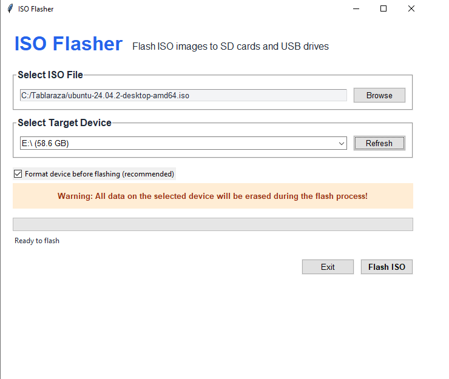
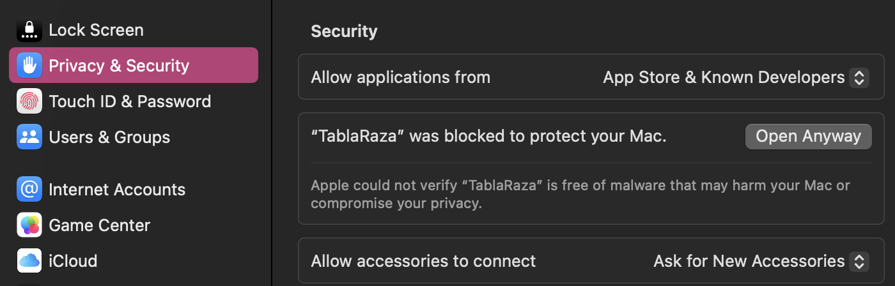

# TablaRaza - ISO Flasher


<br>

TablaRaza is a cross-platform GUI application for flashing ISO images to USB drives and SD cards. This tool provides a simple and intuitive interface for creating bootable media. Does not require admin privileges on Windows!

## Features

- Cross-platform (Windows, macOS, Linux)
- Admin not required in windows for install or usage
- Format devices before flashing

## Download

Pre-built executables are available for download:

- [Windows](https://github.com/Nat-As/Tablaraza/releases/latest/download/TablaRaza-Windows.exe)
- [macOS](https://github.com/Nat-As/Tablaraza/releases/latest/download/TablaRaza-MacOS.dmg)
- [Linux](https://github.com/Nat-As/Tablaraza/releases/latest/download/TablaRaza-Linux)

## Usage

1. Download and run the appropriate executable for your platform
2. Browse and select your ISO file
3. Select the target device from the dropdown
4. Click "Flash ISO" and confirm
5. Wait for the flashing process to complete



**Note:** On Linux you may need to run the application with sudo/admin privileges.

## Building from Source

### Prerequisites

- Python 3.8 or higher
- pip package manager

### Setup

1. Clone the repository:
   ```
   git clone https://github.com/Nat-As/Tablaraza.git
   cd Tablaraza
   ```

2. Install dependencies:
   ```
   pip install -r requirements.txt
   ```

3. Run the application:
   ```
   python main.py
   ```

### Building executables manually

You can build executables manually using PyInstaller:

**Windows:**
```
pyinstaller --onefile --windowed --icon=resources/icon.ico --name=TablaRaza main.py
```

**macOS:**
```
pyinstaller --onefile --windowed --icon=resources/icon.icns --name=TablaRaza main.py
```

**Linux:**
```
pyinstaller --onefile --name=TablaRaza main.py
```

## To-Do / Work in progress
- [x] Make cross-platform
- [x] Runs on windows without requiring admin
- [ ] Runs on Mac OS X without requiring admin
- [ ] Runs on Linux without requiring admin

## Mac Users

Because the software is unsigned, you will have to follow the following steps for installation:

1. Download and open the [.dmg file](https://github.com/Nat-As/Tablaraza/releases/latest/download/TablaRaza-MacOS.dmg)
2. Copy the application into the applications folder
3. Run the program
4. If an untrusted message pops up, you will have to manually enable running the program in ```System settings >> Privacy and Security >> Allow application (At the bottom)```



To make this program run without this, it would have to be signed by an apple developer with a license that costs $99 / Year. Since this is FOSS software, I didn't feel like doing that. Enjoy :)


## License

[MIT](LICENSE)
